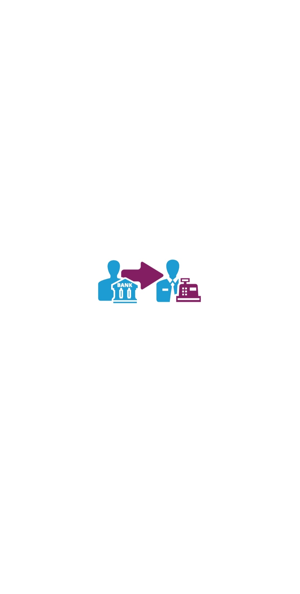
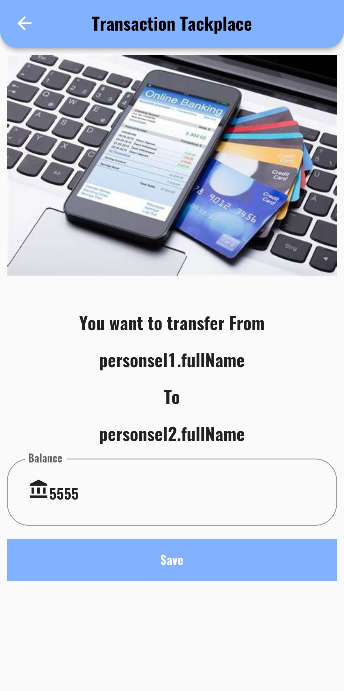
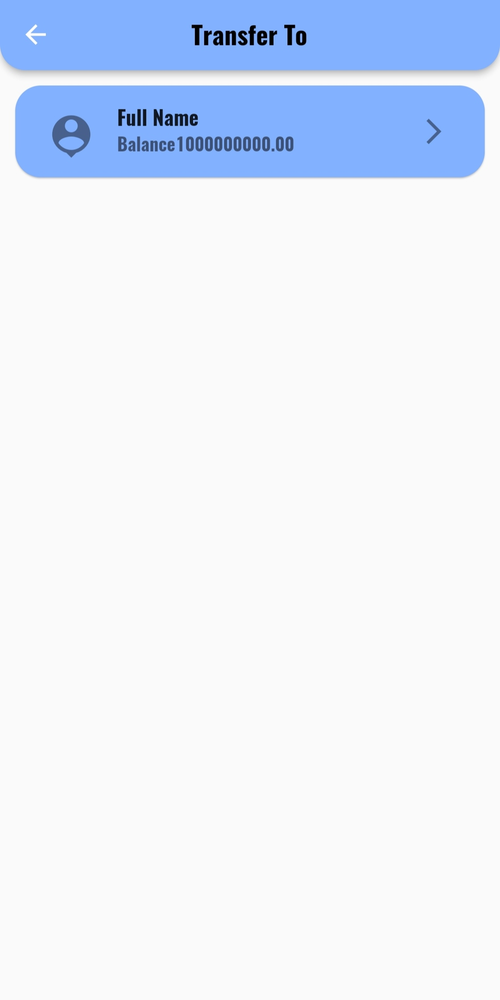
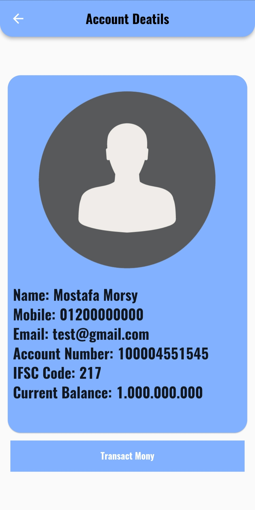
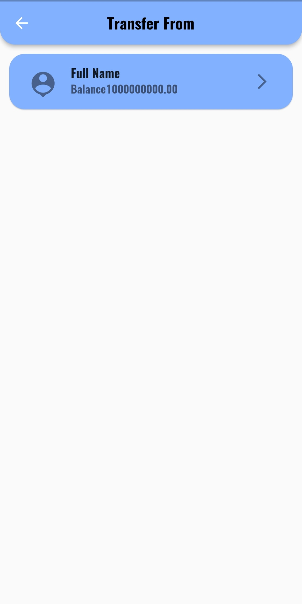
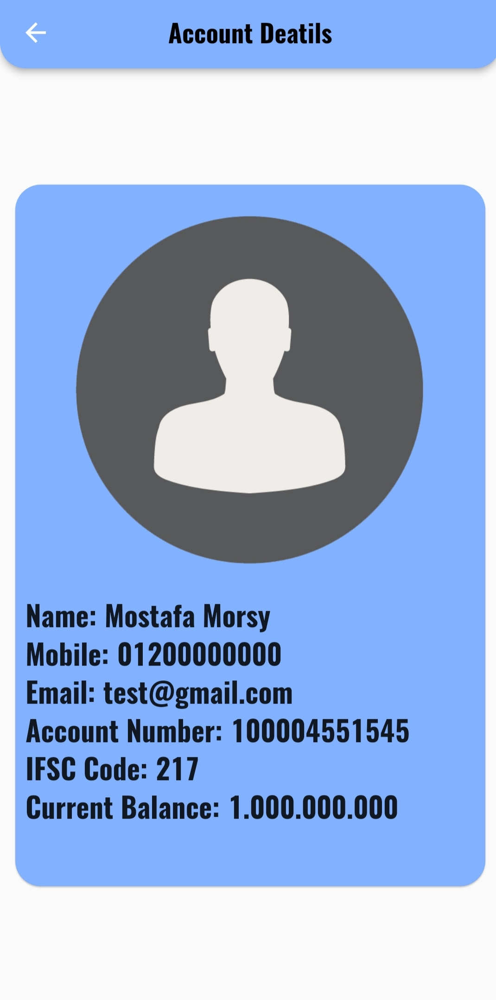
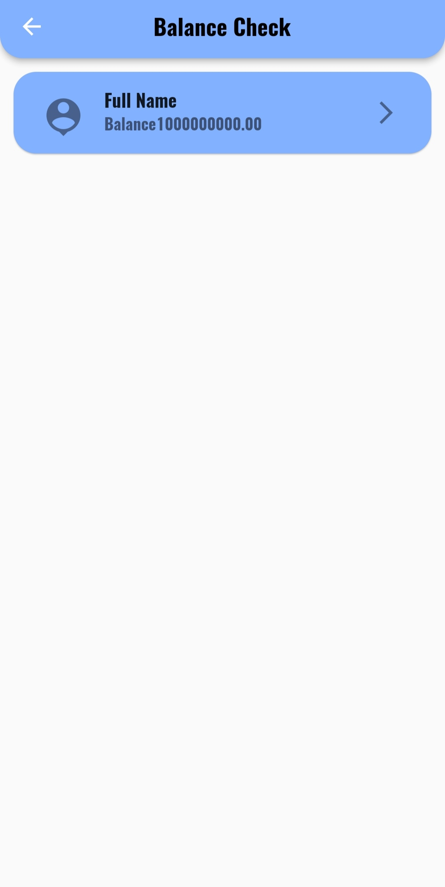
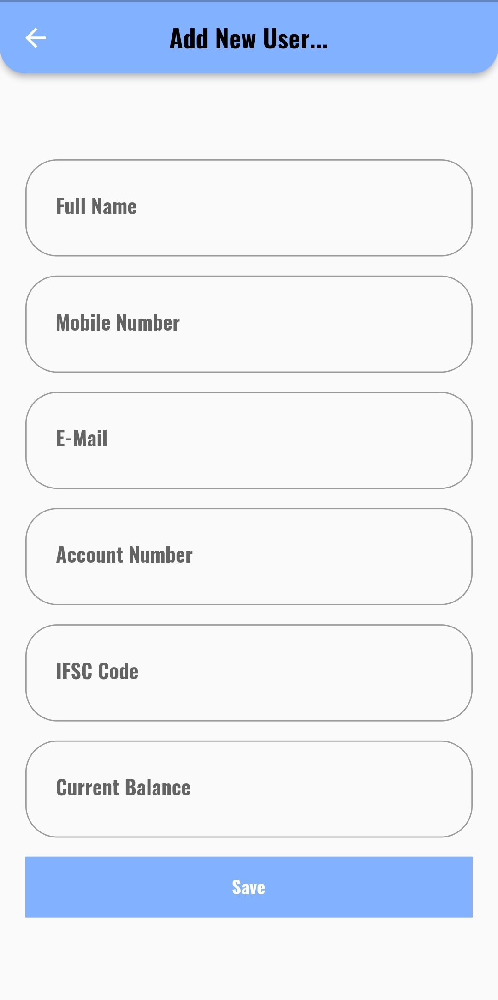
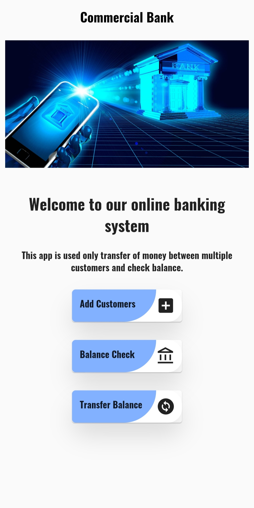
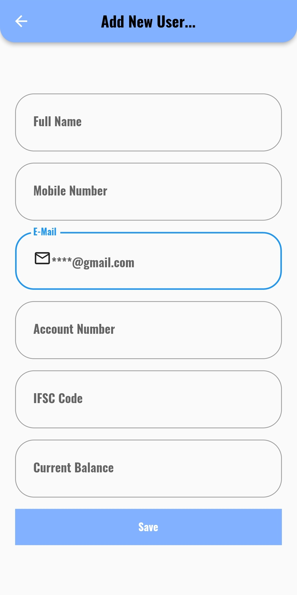

# Basic Bank
   
# introduction: 
    Let me give you a brief overview of the project, 
    Contain an Add Customer in addition to some screen to trancfer balance bettwen accounts.

## This Project Created use :
        - Using MVC as Design Architechter.
        - Solid .
        - Using Responsive UI.
        - Using  SQLite.
        - Using Cubit as state management.

## Screenshot:

